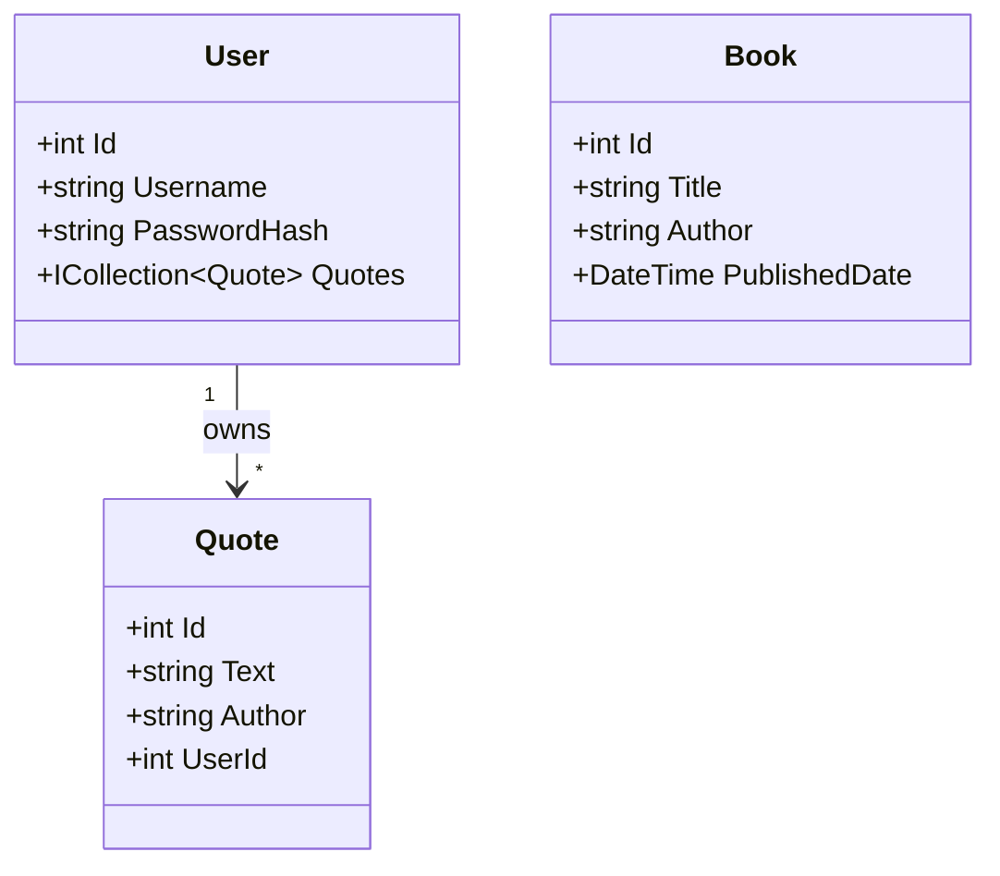

# Data Model

```mermaid
classDiagram
    class User {
        +int Id
        +string Username
        +string PasswordHash
        +ICollection~Quote~ Quotes
    }

    class Quote {
        +int Id
        +string Text
        +string Author
        +int UserId
    }

    class Book {
        +int Id
        +string Title
        +string Author
        +DateTime PublishedDate
    }

    User "1" --> "*" Quote : owns
```